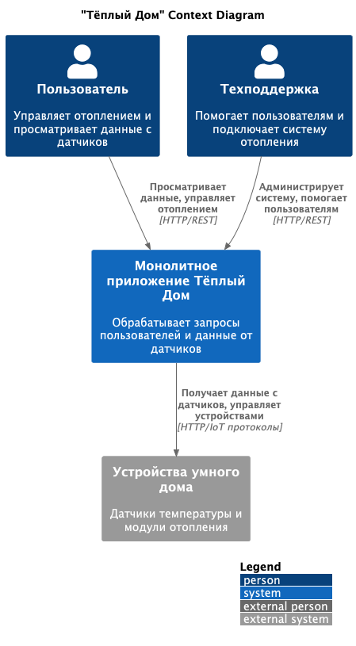
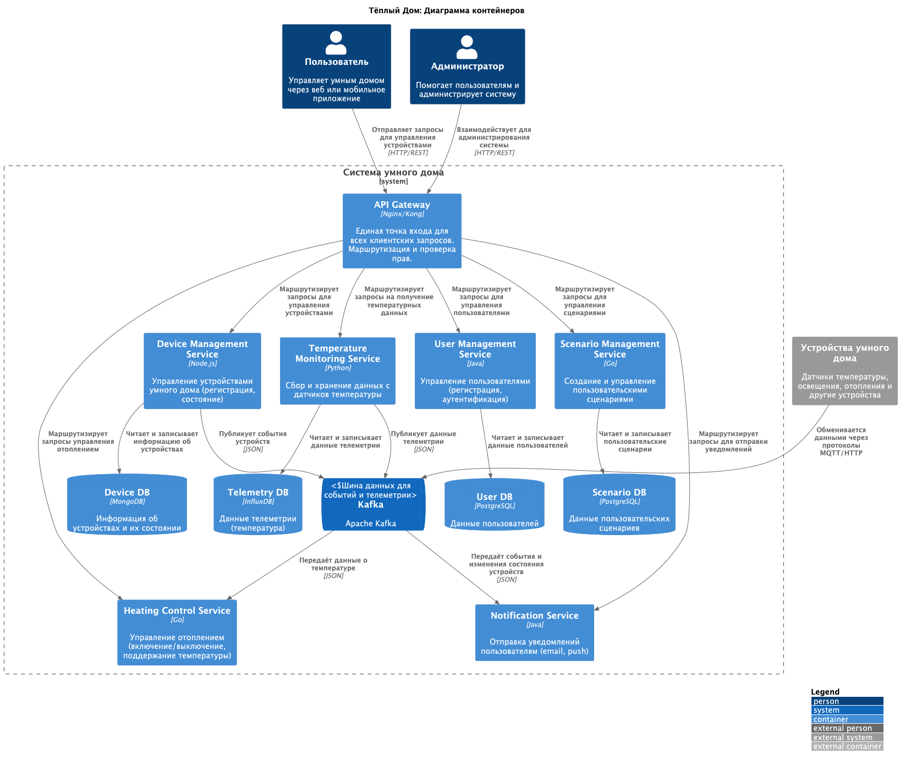
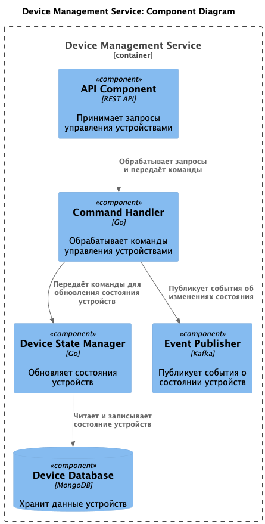
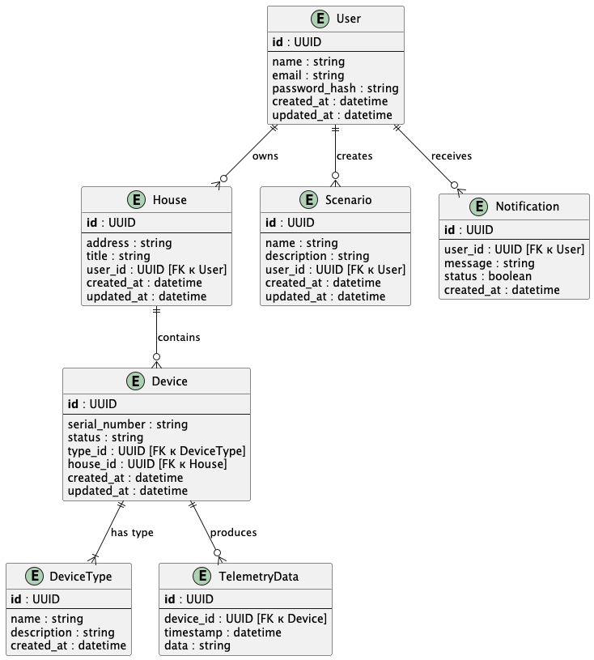

# Проектная работа: Архитектура ПО компании «Тёплый дом»

## Оглавление

1. [Описание проекта](#описание-проекта)
2. [Часть 1. Анализ и планирование](#часть-1-анализ-и-планирование)
3. [Часть 2. Проектирование микросервисной архитектуры](#часть-2-проектирование-микросервисной-архитектуры)
4. [Часть 3. Разработка ER-диаграммы](#часть-3-разработка-er-диаграммы)
5. [Заключение](#заключение)

---

## Описание проекта

«Тёплый дом» занимается созданием экосистемы умных домов. Цель проекта — переход от монолитного приложения к микросервисной архитектуре, обеспечивающей:
- Масштабируемость и гибкость.
- Поддержку новых функций и интеграцию с устройствами партнёров.

---

## Часть 1. Анализ и планирование

### Текущее состояние системы (As-Is)

1. **Функциональность:**
   - Управление отоплением (включение/выключение, установка температуры).
   - Мониторинг температуры с датчиков.

2. **Архитектура:**
   - Тип: Монолитное приложение.
   - Язык: Java.
   - База данных: PostgreSQL.
   - Ограничения: Требуется остановка приложения для обновления.

3. **Проблемы текущей архитектуры:**
   - Ограниченная масштабируемость.
   - Отсутствие гибкости (нет поддержки стандартных протоколов).
   - Пользователи не могут самостоятельно подключать устройства.

### Цель перехода на микросервисную архитектуру

- Устранить проблемы масштабируемости.
- Обеспечить гибкость и асинхронное взаимодействие (через Kafka).
- Поддерживать новые устройства и интеграции.

### Диаграмма контекста (Context Diagram)

Диаграмма ниже визуализирует текущее состояние системы:

Код диаграммы доступен в файле: `diagrams/context.puml`.

---

## Часть 2. Проектирование микросервисной архитектуры

### Уровень Containers

Диаграмма уровня Containers отображает взаимодействие между основными микросервисами, API Gateway, базами данных и шиной данных Kafka.

#### Основные сервисы:
1. **Device Management Service:** Управление устройствами и их состоянием.
2. **Temperature Monitoring Service:** Сбор и хранение данных телеметрии.
3. **User Management Service:** Регистрация и управление пользователями.
4. **Notification Service:** Отправка уведомлений пользователям.
5. **Scenario Management Service:** Управление пользовательскими сценариями автоматизации.

Код диаграммы доступен в файле: `diagrams/container.puml`.

### Уровень Components

Пример диаграммы компонентов для Device Management Service:

Код диаграммы доступен в файле: `diagrams/component.puml`.

---

## Часть 3. Разработка ER-диаграммы

### Описание задачи

ER-диаграмма помогает описать структуру данных системы, включая ключевые сущности и их связи.

#### Основные шаги:
1. Определены сущности:
   - Пользователи, дома, устройства, типы устройств, телеметрия и сценарии.
2. Добавлены атрибуты сущностей, включая идентификаторы, описания и временные метки.
3. Установлены связи между сущностями:
   - Пользователи владеют домами.
   - Дома содержат устройства.
   - Устройства производят телеметрию и имеют тип.

Код диаграммы доступен в файле: `diagrams/er.puml`.

---

## Заключение

Разработанная микросервисная архитектура и структурированная модель данных позволяют:
- Решить текущие проблемы монолитного приложения.
- Обеспечить гибкость и масштабируемость.
- Интегрировать устройства партнёров и добавлять новые функции.

Диаграммы и документация помогают визуализировать переход системы «Тёплый дом» к микросервисной архитектуре.